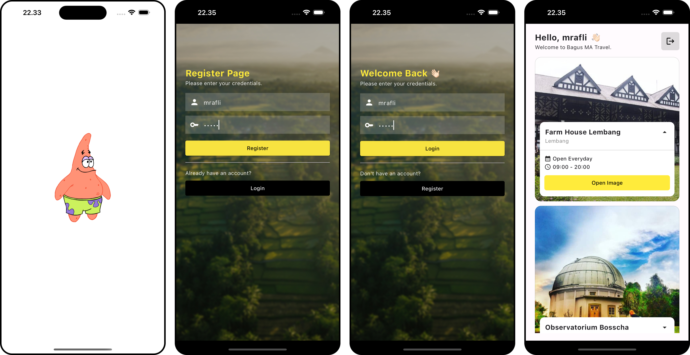

# bma_travel

Bagus MA Travel 🦉

## How to get started

1. Nyalakan mysql server, buat db baru
2. Masuk ke direktori /backend dengan perintah `cd backend/`
3. Import file db bernama bma-travel.sql yang berada pada direktori /backend
4. Jalankan perintah `npm i` untuk menginstall node dependencies
5. Isi file .env berdasarkan file .env.example pada direktori /backend
6. Jalankan web service (`npm run dev`) pada direktori /backend
7. Jalankan project flutter (`flutter run`) pada direktori root
8. 🏃🏻‍♂️‍➡️

## Screenshot   📸

